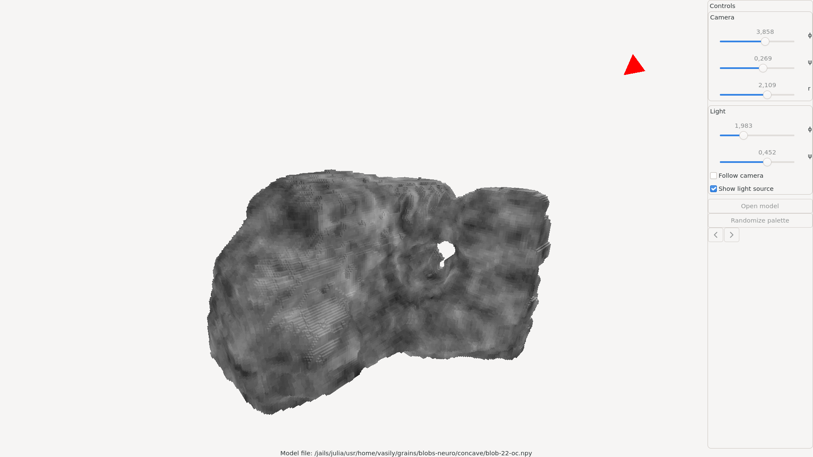
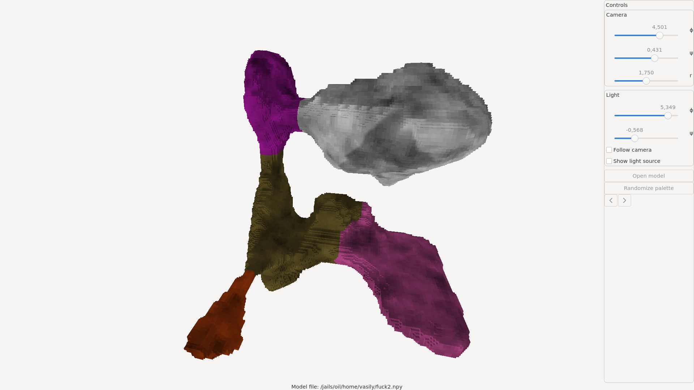

# Voxview: Simple voxel viewer

## Intro

This program visualizes three-dimensional arrays of bits by drawing a small cube
on the boundary between 0 and 1 values in the array. This can be useful for
visualizing various spatial data in a voxel form.

## Screenshots

| Screenshot 1 | Screenshot 2 |
|--------------|--------------|
|  |    |

## Requirements

Hardware: 

* An OpenGL 4.3 compatible videocard

Software: 

* GTK4
* A modern Common Lisp implementation (tested with SBCL 2.5.0)
* Qlot

## Installation

In this directory, run

~~~~
$ qlot install
$ qlot exec sbcl --dynamic-space-size 16gb
~~~~

This will start SBCL REPL. In the REPL run

~~~~
* (asdf:make :voxview)
~~~~

Install a produced binary to your binary directory if you wish.

## Features

* Value noise texturing
* Ambient and diffuse lights
* Shadow map from a single point light source.
