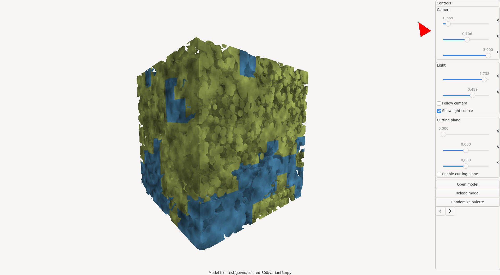
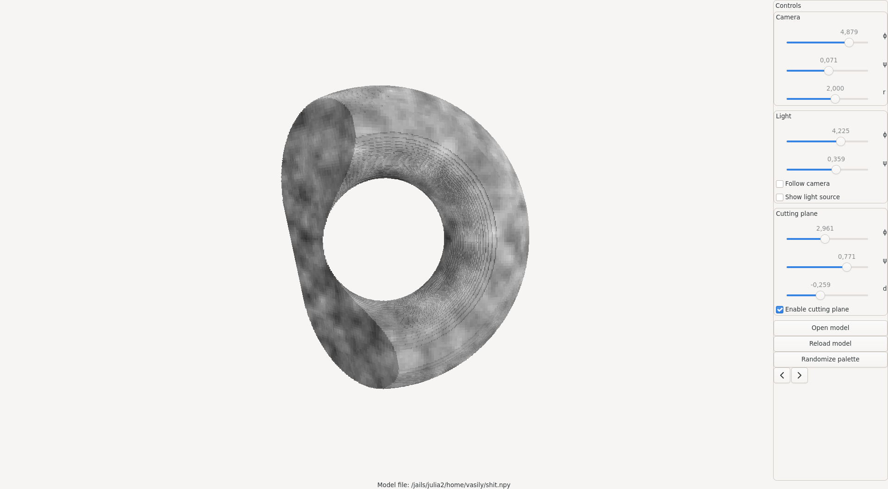

# Voxview: Simple voxel viewer

## Intro

This program visualizes three-dimensional voxel data.

It accepts input in the form of numpy arrays (`.npy`) with `dtype == 'bool'` or
`dtype == 'uint32'`. If an array has `uint32` elements voxview assigns its own
random color for each non-zero value which appears in the array.

## Screenshots

| Screenshot 1 | Screenshot 2 |
|--------------|--------------|
|  |    |

## Requirements

Hardware: 

* An OpenGL 4.3 compatible videocard (now I am not sure, maybe just 3.0 will do ;)

Software: 

* GTK4
* A modern Common Lisp implementation (tested with SBCL 2.5.0)
* Qlot

## Installation

In this directory, run

~~~~
$ qlot install
$ qlot exec sbcl --dynamic-space-size 32gb
~~~~

This will start SBCL REPL. In the REPL run

~~~~
* (asdf:make :voxview)
~~~~

Install a produced binary to your binary directory if you wish.

## Features

* Value noise texturing
* Ambient and diffuse lights
* Shadow map from a single point light source.
* Cutting plane

## Tips

You can view the next or the previous model in the same directory by pressing
`Alt-d` or `Alt-a` respectively.

Camera position can be controlled by mouse when the left mouse button is
pressed. Position of the light source can be controlled in the same manner with
the right button pressed and the "Follow camera" checkbox deselected.
